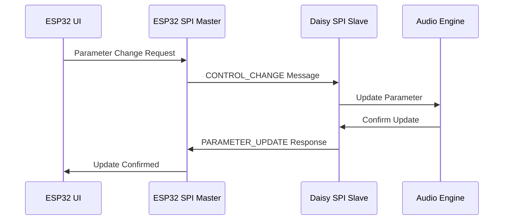
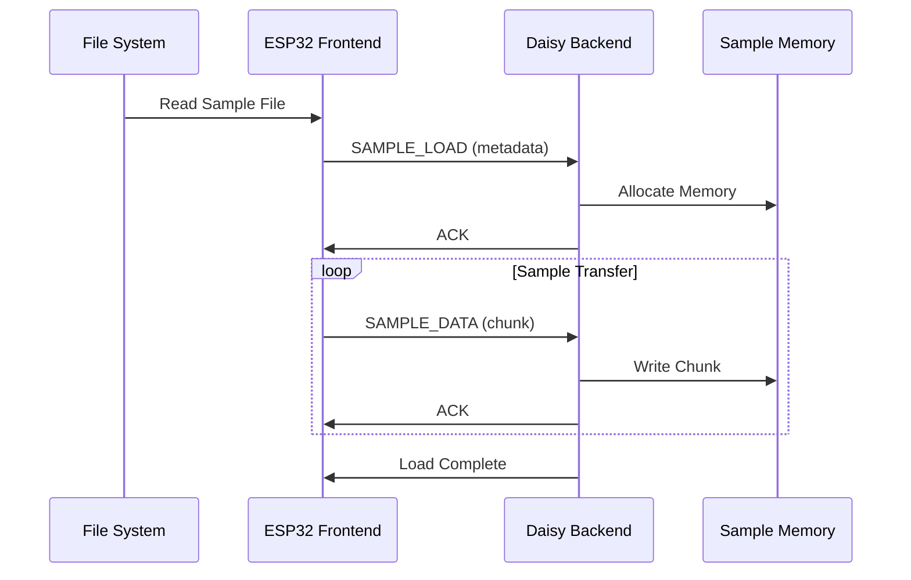
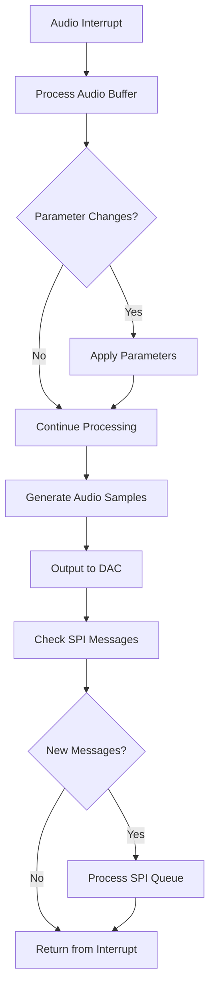

# WaveX Inter-MCU Communication Protocol

## Overview

The WaveX dual-MCU architecture uses a high-speed SPI communication protocol to exchange control data, audio parameters, and sample information between the ESP32-S3 frontend and the STM32H750 (Daisy Seed) backend.

## Architecture Diagram

```
┌─────────────────────────────────────┐    SPI Bus    ┌─────────────────────────────────────┐
│             ESP32-S3                │◄─────────────►│          STM32H750                  │
│            (Frontend)               │               │          (Backend)                  │
├─────────────────────────────────────┤               ├─────────────────────────────────────┤
│ • Touchscreen UI (LVGL)             │               │ • Real-time Audio Engine            │
│ • File Management                   │               │ • Sample Playback                   │
│ • MIDI I/O                          │               │ • Envelopes & LFOs                  │
│ • User Controls                     │               │ • CV Output (SPI DACs)              │
│ • Parameter Processing              │               │ • DSP Processing                    │
│                                     │               │                                     │
│ ┌─────────────────────────────────┐ │               │ ┌─────────────────────────────────┐ │
│ │        SPI Master               │ │               │ │        SPI Slave                │ │
│ │ • Protocol Handler              │ │               │ │ • Command Processor             │ │
│ │ • Message Queue                 │ │               │ │ • Parameter Updates             │ │
│ │ • Sample Transfer               │ │               │ │ • Status Reporting              │ │
│ └─────────────────────────────────┘ │               │ └─────────────────────────────────┘ │
└─────────────────────────────────────┘               └─────────────────────────────────────┘
```

## SPI Configuration

### Physical Connection
```
ESP32-S3 (Master)          STM32H750 (Slave)
─────────────────          ──────────────────
GPIO12 (MISO)     ◄────────  PA6 (SPI1_MISO)
GPIO13 (MOSI)     ─────────► PA7 (SPI1_MOSI)
GPIO14 (SCLK)     ─────────► PA5 (SPI1_SCK)
GPIO15 (CS)       ─────────► PA4 (SPI1_NSS)
GPIO16 (IRQ)      ◄────────  PB0 (GPIO_OUT)
```

### SPI Parameters
- **Clock Speed**: 10 MHz (adjustable based on testing)
- **Mode**: SPI Mode 0 (CPOL=0, CPHA=0)
- **Bit Order**: MSB First
- **Data Width**: 8 bits
- **CS Active**: Low

## Protocol Structure

### Packet Format

All communication uses a standardized packet format:

```
┌─────────┬─────────┬─────────┬─────────────────┬─────────┐
│  SYNC   │  TYPE   │ LENGTH  │    PAYLOAD      │   CRC   │
│ (1 byte)│ (1 byte)│ (1 byte)│   (0-64 bytes)  │ (1 byte)│
└─────────┴─────────┴─────────┴─────────────────┴─────────┘
```

### Header Fields

| Field  | Size | Value | Description |
|--------|------|-------|-------------|
| SYNC   | 1    | 0xAA  | Synchronization byte |
| TYPE   | 1    | 0x00-0xFF | Message type identifier |
| LENGTH | 1    | 0-64  | Payload length in bytes |
| CRC    | 1    | 0x00-0xFF | Simple checksum of packet |

## Message Types

### Control Messages (0x00-0x0F)

#### 0x00 - SYNC
Synchronization and heartbeat message.
```c
// No payload
```

#### 0x01 - CONTROL_CHANGE
Parameter change from frontend to backend.
```c
struct ControlChangeMessage {
    uint8_t parameter;    // Parameter ID (see Parameter Map)
    uint8_t channel;      // Channel/voice number (0-15)
    uint16_t value;       // Parameter value (0-65535)
};
```

#### 0x02 - NOTE_ON
MIDI note on event.
```c
struct NoteOnMessage {
    uint8_t channel;      // MIDI channel (0-15)
    uint8_t note;         // MIDI note number (0-127)
    uint8_t velocity;     // Note velocity (0-127)
    uint8_t voice_id;     // Assigned voice ID
};
```

#### 0x03 - NOTE_OFF
MIDI note off event.
```c
struct NoteOffMessage {
    uint8_t channel;      // MIDI channel (0-15)
    uint8_t note;         // MIDI note number (0-127)
    uint8_t velocity;     // Release velocity (0-127)
    uint8_t voice_id;     // Voice ID to release
};
```

### Sample Management (0x10-0x1F)

#### 0x04 - SAMPLE_LOAD
Request to load a sample into memory.
```c
struct SampleLoadMessage {
    uint32_t sample_id;   // Unique sample identifier
    uint32_t size;        // Sample size in bytes
    uint16_t sample_rate; // Sample rate (Hz)
    uint8_t channels;     // Number of channels (1-2)
    uint8_t bit_depth;    // Bit depth (16, 24)
};
```

#### 0x05 - SAMPLE_DATA
Sample data transfer chunk.
```c
struct SampleDataMessage {
    uint32_t sample_id;   // Sample identifier
    uint32_t offset;      // Byte offset in sample
    uint16_t chunk_size;  // Size of this chunk
    uint8_t data[];       // Sample data (up to 58 bytes)
};
```

### Status and Response (0x20-0x2F)

#### 0x06 - PARAMETER_UPDATE
Parameter value update from backend to frontend.
```c
struct ParameterUpdateMessage {
    uint8_t parameter;    // Parameter ID
    uint8_t channel;      // Channel number
    uint16_t value;       // Current value
    uint32_t timestamp;   // Timestamp (optional)
};
```

#### 0x07 - STATUS_REQUEST
Request status information from backend.
```c
struct StatusRequestMessage {
    uint8_t status_type;  // Type of status requested
    uint8_t reserved[3];  // Reserved for future use
};
```

#### 0x08 - STATUS_RESPONSE
Status information from backend.
```c
struct StatusResponseMessage {
    uint8_t status_type;  // Status type
    uint8_t cpu_usage;    // CPU usage percentage
    uint16_t memory_free; // Free memory in KB
    uint32_t uptime;      // Uptime in milliseconds
};
```

#### 0xFF - ERROR
Error message.
```c
struct ErrorMessage {
    uint8_t error_code;   // Error code
    uint8_t source;       // Error source
    uint16_t context;     // Additional context
};
```

## Parameter Map

### Audio Parameters (0x01-0x3F)

| ID | Parameter | Range | Description |
|----|-----------|-------|-------------|
| 0x01 | VOLUME | 0-65535 | Master volume |
| 0x02 | FILTER_CUTOFF | 0-65535 | Filter cutoff frequency |
| 0x03 | FILTER_RESONANCE | 0-65535 | Filter resonance |
| 0x04 | ENVELOPE_ATTACK | 0-65535 | Envelope attack time |
| 0x05 | ENVELOPE_DECAY | 0-65535 | Envelope decay time |
| 0x06 | ENVELOPE_SUSTAIN | 0-65535 | Envelope sustain level |
| 0x07 | ENVELOPE_RELEASE | 0-65535 | Envelope release time |
| 0x08 | LFO_RATE | 0-65535 | LFO frequency |
| 0x09 | LFO_DEPTH | 0-65535 | LFO modulation depth |
| 0x0A | SAMPLE_START | 0-65535 | Sample start position |
| 0x0B | SAMPLE_END | 0-65535 | Sample end position |
| 0x0C | SAMPLE_LOOP | 0-1 | Sample loop enable |

### Effects Parameters (0x40-0x7F)

| ID | Parameter | Range | Description |
|----|-----------|-------|-------------|
| 0x40 | REVERB_SIZE | 0-65535 | Reverb room size |
| 0x41 | REVERB_DECAY | 0-65535 | Reverb decay time |
| 0x42 | DELAY_TIME | 0-65535 | Delay time |
| 0x43 | DELAY_FEEDBACK | 0-65535 | Delay feedback |
| 0x44 | CHORUS_RATE | 0-65535 | Chorus rate |
| 0x45 | CHORUS_DEPTH | 0-65535 | Chorus depth |

## Communication Flow Diagrams

### Parameter Change Flow



### Sample Loading Flow



### Real-time Audio Flow



## Timing Specifications

### Message Timing
- **Maximum Message Rate**: 1000 messages/second
- **SPI Transaction Time**: ~50μs per message
- **Audio Buffer Size**: 64 samples (1.33ms at 48kHz)
- **Parameter Update Latency**: <2ms

### Priority Levels
1. **Critical**: Audio interrupts, real-time parameters
2. **High**: Note on/off, immediate control changes
3. **Medium**: Sample loading, status updates
4. **Low**: Configuration, diagnostics

## Error Handling

### Error Codes

| Code | Name | Description |
|------|------|-------------|
| 0x01 | INVALID_MESSAGE | Malformed message received |
| 0x02 | PARAMETER_OUT_OF_RANGE | Parameter value invalid |
| 0x03 | SAMPLE_LOAD_FAILED | Sample loading error |
| 0x04 | MEMORY_FULL | Insufficient memory |
| 0x05 | SPI_TIMEOUT | Communication timeout |
| 0x06 | CHECKSUM_ERROR | Message corruption detected |

### Recovery Mechanisms
- **Automatic Retry**: Up to 3 retries for failed messages
- **Watchdog Timer**: Reset communication if no heartbeat
- **Graceful Degradation**: Continue audio processing if UI disconnected
- **Error Reporting**: Log errors for debugging

## Implementation Notes

### Buffer Management
- **Circular Buffers**: Used for message queuing on both sides
- **DMA Transfer**: SPI uses DMA for efficient data transfer
- **Memory Alignment**: All structures aligned for optimal performance

### Synchronization
- **IRQ Line**: Daisy signals ESP32 when ready for new messages
- **Heartbeat**: Regular SYNC messages maintain connection
- **Flow Control**: Prevent buffer overflow with acknowledgments

### Performance Optimization
- **Message Batching**: Combine multiple parameter changes
- **Compression**: Compact representation for large data transfers
- **Caching**: Cache frequently accessed parameters locally

## Testing and Validation

### Protocol Validation
- **Message Integrity**: CRC checking on all packets
- **Timing Analysis**: Measure latency and jitter
- **Stress Testing**: High-frequency message bursts
- **Error Injection**: Test recovery mechanisms

### Debug Features
- **Message Logging**: Capture all SPI transactions
- **Performance Counters**: Track timing statistics
- **Protocol Analyzer**: Real-time message inspection
- **Simulation Mode**: Test without hardware

This protocol provides a robust, efficient communication layer enabling seamless coordination between the ESP32 frontend and Daisy backend while maintaining real-time audio performance.
