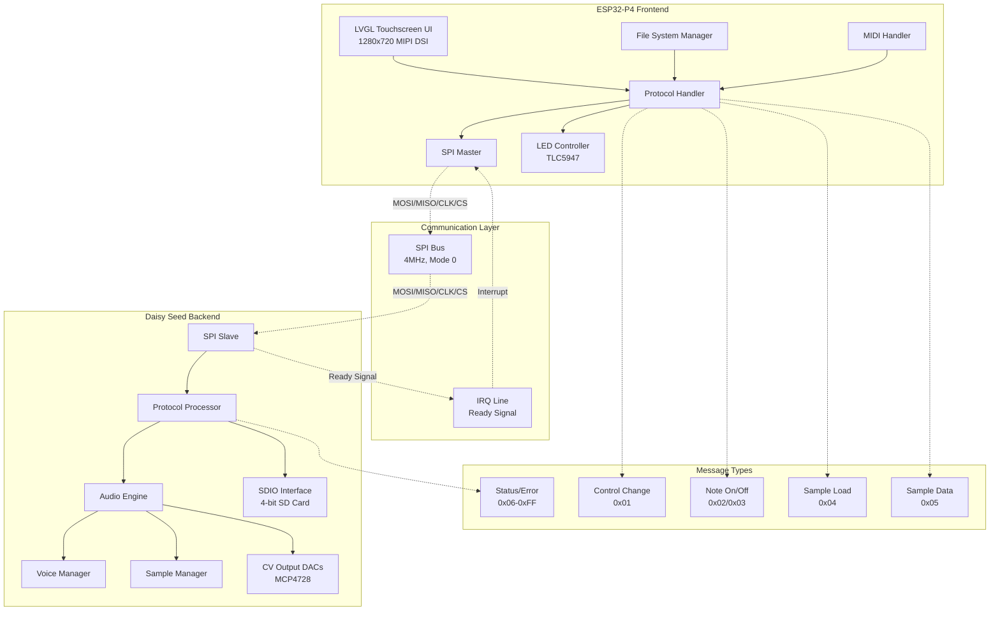
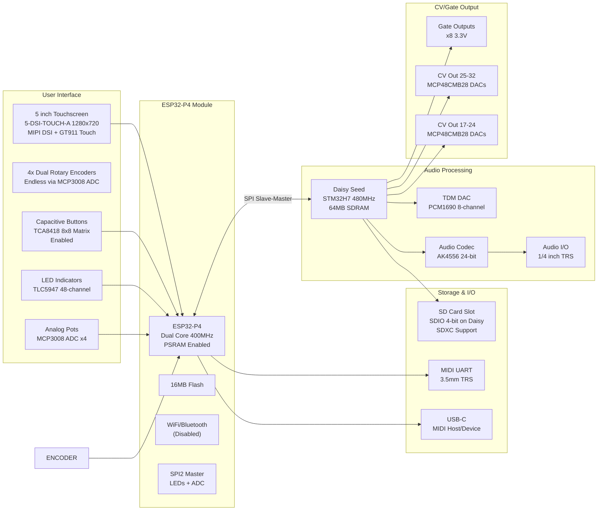
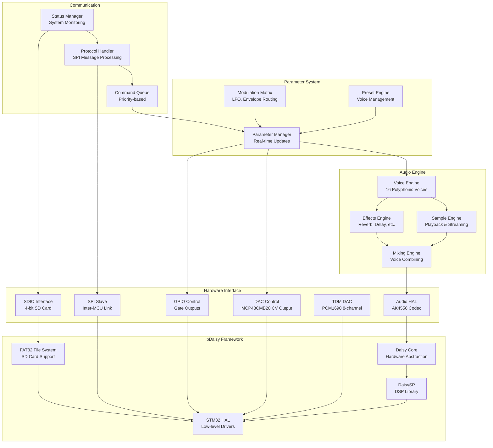
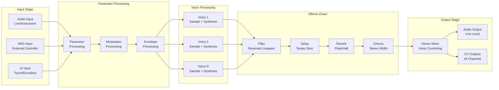
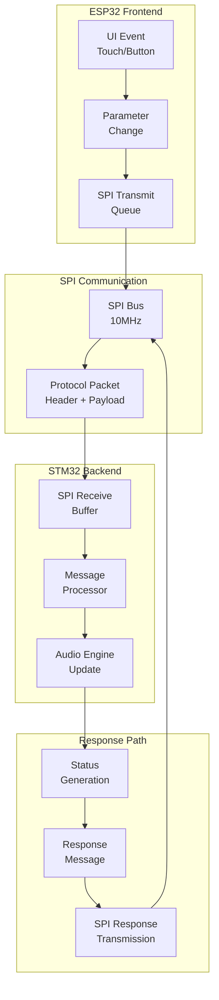
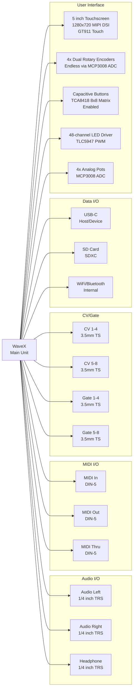

# WaveX System Architecture

## Overview

The WaveX dual-MCU sampler/synthesizer implements a distributed architecture that separates user interface and file management from real-time audio processing, optimizing each microcontroller for its specific role.

## High-Level System Architecture



## Hardware Architecture

### Physical Layout


## Software Architecture

### ESP32-P4 Frontend Components
```mermaid
graph TD
    subgraph "Application Layer"
        UI_APP[UI Application<br/>LVGL-based]
        FILE_MGR[File Manager<br/>Sample Browser]
        PRESET_MGR[Preset Manager<br/>Save/Load]
        MIDI_APP[MIDI Application<br/>USB MIDI]
    end

    subgraph "Service Layer"
        AUDIO_SVC[Audio Service<br/>Parameter Management]
        COMM_SVC[Communication Service<br/>SPI Protocol Handler]
        STORAGE_SVC[Storage Service<br/>USB Management]
        CONFIG_SVC[Configuration Service<br/>Settings]
        LED_SVC[LED Service<br/>TLC5947 Control]
    end

    subgraph "Hardware Abstraction"
        TOUCH_HAL[Touch Driver<br/>GT911 I2C]
        DISPLAY_HAL[Display Driver<br/>MIPI DSI hx8394]
        SPI_MASTER[SPI Master<br/>Inter-MCU Link]
        SPI2_MASTER[SPI2 Master<br/>LEDs + ADC]
        PCNT_HAL|[PEC24R encoder<br>Encoder]
        ADC_HAL[ADC Driver<br/>MCP3008 for Encoders]
        I2C_HAL[I2C Driver<br/>Touch + Buttons]
        UART_MIDI[MIDI UART<br/>31250 baud]
    end
    
    subgraph "ESP-IDF Framework"
        FREERTOS[FreeRTOS<br/>Task Scheduler]
        DRIVERS[Hardware Drivers]
        NETWORK[WiFi/Bluetooth<br/>(Disabled)]
    end

    UI_APP --> AUDIO_SVC
    FILE_MGR --> STORAGE_SVC
    PRESET_MGR --> CONFIG_SVC
    MIDI_APP --> COMM_SVC

    AUDIO_SVC --> COMM_SVC
    COMM_SVC --> SPI_MASTER
    STORAGE_SVC --> LED_SVC

    TOUCH_HAL --> I2C_HAL
    DISPLAY_HAL --> DRIVERS
    SPI_MASTER --> DRIVERS
    SPI2_MASTER --> DRIVERS
    ADC_HAL --> SPI2_MASTER
    I2C_HAL --> DRIVERS
    UART_MIDI --> DRIVERS

    LED_SVC --> SPI2_MASTER
    DRIVERS --> FREERTOS
```

### Daisy Seed Backend Components


## Data Flow Architecture

### Audio Processing Pipeline


### Communication Data Flow


## Memory Architecture

### ESP32-P4 Memory Layout
```
┌─────────────────────────────────────────────────────────────┐
│                    ESP32-P4 Memory Map                      │
├─────────────────────────────────────────────────────────────┤
│ Internal SRAM (1.25MB)                                      │
│ ├─ Stack/Heap (512KB)                                      │
│ ├─ LVGL Double Buffers (320KB x2)                          │
│ ├─ Protocol Ring Buffers (128KB)                           │
│ ├─ MIPI DSI Frame Buffer (256KB)                           │
│ └─ System Reserved (128KB)                                 │
├─────────────────────────────────────────────────────────────┤
│ External PSRAM (Enabled)                                    │
│ ├─ UI Graphics Cache (Variable)                            │
│ ├─ LVGL PSRAM Buffers (if >20KB threshold)                 │
│ └─ Application Heap (Variable)                             │
├─────────────────────────────────────────────────────────────┤
│ Flash Memory (16MB)                                         │
│ ├─ Application Code (8MB)                                  │
│ ├─ File System (4MB)                                       │
│ ├─ Configuration (2MB)                                     │
│ └─ OTA Updates (2MB)                                       │
└─────────────────────────────────────────────────────────────┘
```

### Daisy Seed Memory Layout
```
┌─────────────────────────────────────────────────────────────┐
│                   Daisy Seed Memory Map                     │
├─────────────────────────────────────────────────────────────┤
│ Internal SRAM (512KB)                                       │
│ ├─ Audio Buffers (256KB)                                   │
│ ├─ Voice Data (128KB)                                      │
│ ├─ Protocol Ring Buffers (64KB)                            │
│ └─ System Stack/Heap (64KB)                                │
├─────────────────────────────────────────────────────────────┤
│ External SDRAM (64MB)                                       │
│ ├─ Sample Storage (48MB)                                   │
│ ├─ Audio Processing Buffers (8MB)                          │
│ ├─ Effects Buffers (4MB)                                   │
│ └─ Parameter Storage (4MB)                                 │
├─────────────────────────────────────────────────────────────┤
│ QSPI Flash (8MB)                                           │
│ ├─ Application Code (4MB)                                  │
│ ├─ Sample Library (2MB)                                    │
│ └─ Configuration (2MB)                                     │
├─────────────────────────────────────────────────────────────┤
│ SD Card (External, SDIO 4-bit)                              │
│ ├─ User Samples (Variable)                                 │
│ └─ Preset Storage (Variable)                               │
└─────────────────────────────────────────────────────────────┘
```

## Performance Characteristics

### Real-Time Constraints
- **Audio Latency**: <3ms (input to output)
- **Parameter Update**: <1ms (UI to audio)
- **Sample Loading**: <100ms (per MB)
- **Voice Allocation**: <100μs
- **Effect Processing**: <500μs per voice

### Throughput Specifications
- **SPI Communication**: 4 MHz (ESP32 slave, Daisy master)
- **Audio Processing**: 48kHz/24-bit stereo + 8-channel TDM
- **Voice Polyphony**: 16 simultaneous voices
- **Sample Rate**: Up to 96kHz (configurable)
- **CV Update Rate**: 1kHz per channel
- **Display**: 1280x720 MIPI DSI @1500Mbps lane bitrate
- **SDIO**: 4-bit SD card interface on Daisy

## System Interfaces

### External Connectivity


## Detailed Hardware Configuration

### ESP32-P4 Pin Assignments

#### MIPI DSI Display Interface
- **Data Lanes**: GPIO2 (D0P), GPIO3 (D0N), GPIO4 (D1P), GPIO5 (D1N)
- **Clock**: GPIO6 (CLKP), GPIO7 (CLKN)
- **Control**: GPIO8 (RST), GPIO9 (BL)

#### Touch Interface (GT911 I2C)
- **I2C Bus**: GPIO20 (SDA), GPIO21 (SCL)
- **Control**: GPIO14 (RST), GPIO15 (INT)

#### Inter-MCU Communication (SPI Slave)
- **SPI**: GPIO48 (SCK), GPIO49 (MOSI), GPIO50 (MISO), GPIO51 (CS)
- **IRQ**: GPIO31 (ATTN_OUT)

#### Rotary Encoders (MCP3008 ADC)
- **4x Dual Rotary Encoders**: Connected via MCP3008 ADC channels
- **ADC**: GPIO47 (MOSI), GPIO52 (MISO), GPIO46 (SCK), GPIO29 (CS)

#### MIDI UART
- **UART2**: GPIO32 (TX), GPIO33 (RX) @31250 baud

#### SPI2 Master (LEDs + Encoders)
- **SPI2**: GPIO47 (MOSI), GPIO52 (MISO), GPIO46 (SCK)
- **TLC5947**: GPIO28 (XLAT), GPIO27 (BLANK)
- **MCP3008**: GPIO29 (CS) - Rotary encoders + potentiometers

#### I2C Shared Bus (Touch + Buttons)
- **GT911 Touch**: GPIO20 (SDA), GPIO21 (SCL), GPIO14 (RST), GPIO15 (INT)
- **TCA8418 Buttons**: GPIO20 (SDA), GPIO21 (SCL), GPIO30 (INT)

### Daisy Seed Pin Assignments

#### Inter-MCU Communication (SPI Master)
- **SPI1**: D8 (SCK), D10 (MOSI), D9 (MISO), D7 (CS)
- **IRQ**: D0 (ATTN_IN)

#### Audio Interface (AK4556)
- **Built-in codec**: Standard Daisy audio I/O

#### CV Output DACs (MCP48CMB28)
- **DAC1**: D25 (CS), **DAC2**: D26 (CS), **DAC3**: D27 (CS), **DAC4**: D28 (CS)
- **SPI**: D29 (SCK), D30 (MOSI)

#### TDM DAC (PCM1690)
- **SAI2**: D24 (BCLK), D23 (LRCK), D22 (DATA), D21 (MCLK)

#### SD Card (SDIO 4-bit)
- **SDIO**: D19 (CS), D20 (SCK), D18 (MOSI), D17 (MISO)

### Hardware Component Configuration

#### Audio Engine (Daisy)
- **Sample Rate**: 48kHz
- **Block Size**: 48 samples
- **Buffer Size**: 256 samples
- **Meters Update**: 100ms intervals

#### Display (ESP32)
- **Resolution**: 1280x720
- **Interface**: MIPI DSI
- **Color Depth**: 16-bit RGB565
- **Controller**: HX8394
- **Touch**: GT911 I2C

#### LED Driver (TLC5947)
- **Channels**: 48
- **PWM Frequency**: 1000Hz
- **Bit Depth**: 12-bit brightness

#### ADC (MCP3008)
- **Channels**: 8 total (4x rotary encoders + 4x potentiometers)
- **Resolution**: 10-bit
- **Samples**: 64 per reading
- **Rotary Encoders**: 4x dual endless encoders

#### Button Matrix (TCA8418)
- **Matrix**: 8x8 capacitive buttons
- **I2C Address**: Standard
- **I2C Bus**: Shared with GT911 touch controller
- **Debounce**: 50ms
- **Interrupt**: GPIO30

This architecture provides a clear separation of concerns, optimizing each microcontroller for its specific role while maintaining tight integration through the high-speed SPI communication protocol. 