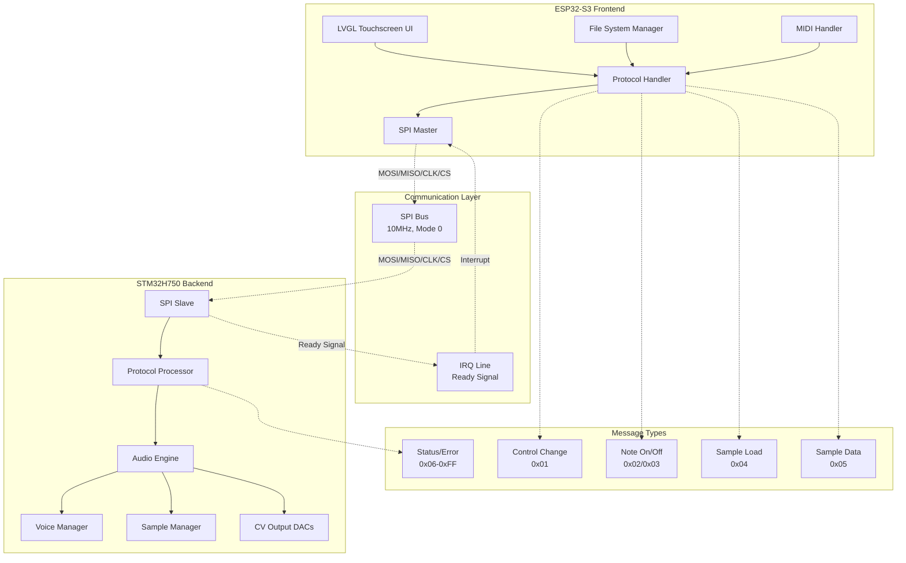
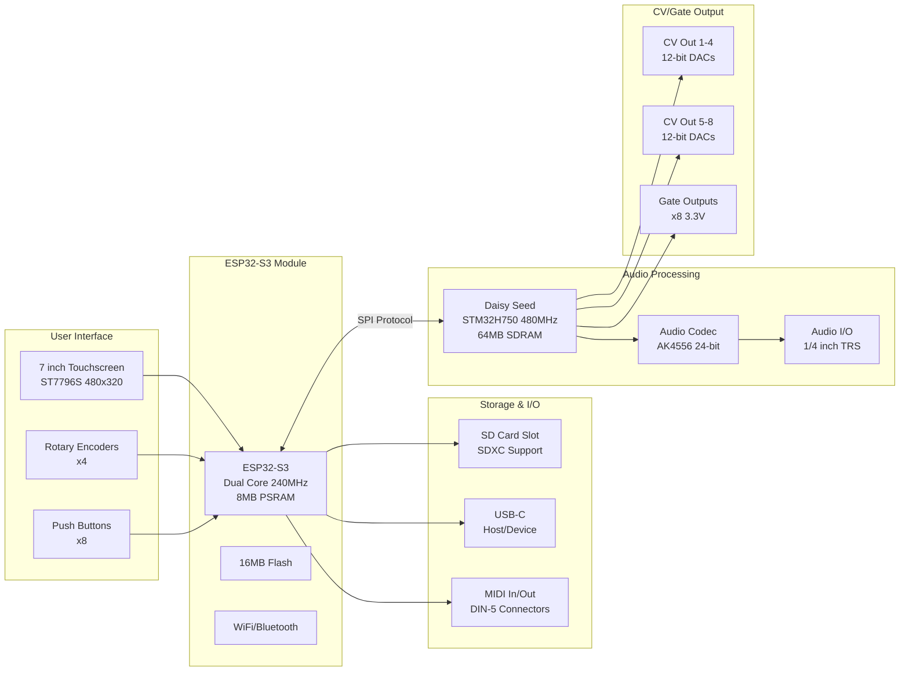
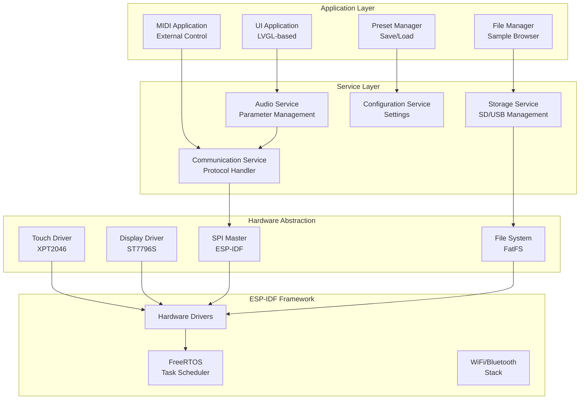
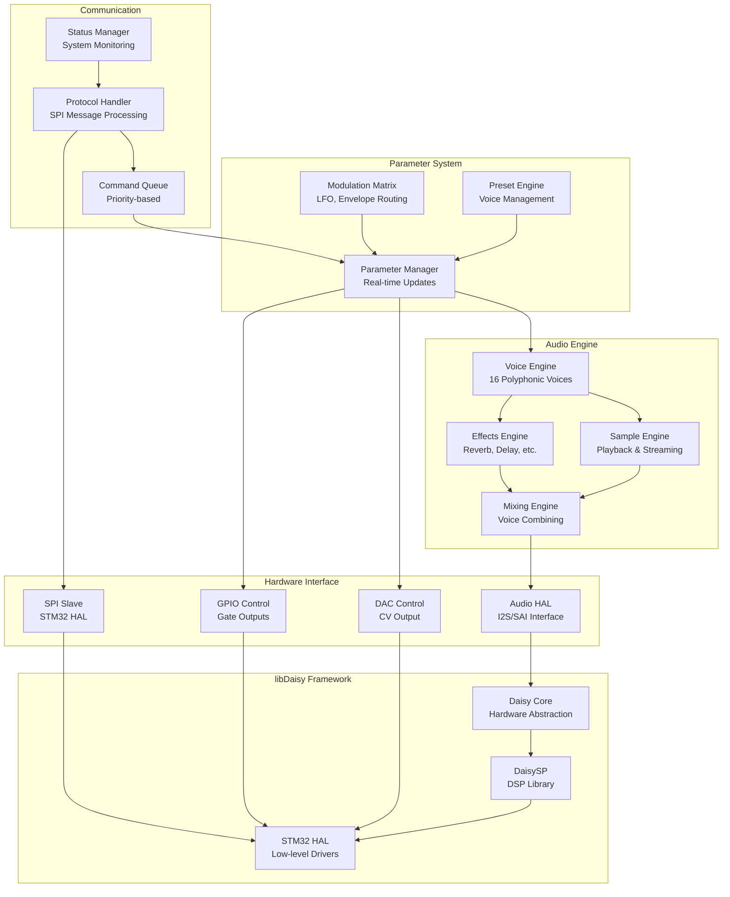
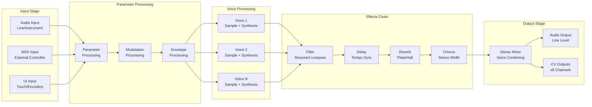
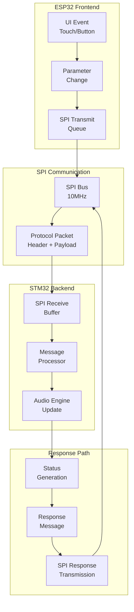
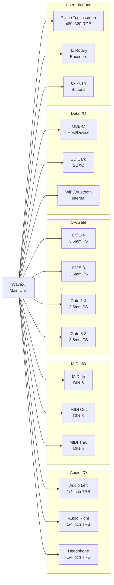

# WaveX System Architecture

## Overview

The WaveX dual-MCU sampler/synthesizer implements a distributed architecture that separates user interface and file management from real-time audio processing, optimizing each microcontroller for its specific role.

## High-Level System Architecture



## Hardware Architecture

### Physical Layout


## Software Architecture

### ESP32-S3 Frontend Components


### STM32H750 Backend Components


## Data Flow Architecture

### Audio Processing Pipeline


### Communication Data Flow


## Memory Architecture

### ESP32-S3 Memory Layout
```
┌─────────────────────────────────────────────────────────────┐
│                    ESP32-S3 Memory Map                      │
├─────────────────────────────────────────────────────────────┤
│ Internal SRAM (512KB)                                       │
│ ├─ Stack/Heap (256KB)                                      │
│ ├─ LVGL Buffers (128KB)                                    │
│ ├─ Protocol Buffers (64KB)                                 │
│ └─ System Reserved (64KB)                                  │
├─────────────────────────────────────────────────────────────┤
│ External PSRAM (8MB)                                        │
│ ├─ UI Graphics Cache (4MB)                                 │
│ ├─ File System Cache (2MB)                                 │
│ ├─ Sample Preview Buffer (1MB)                             │
│ └─ Application Heap (1MB)                                  │
├─────────────────────────────────────────────────────────────┤
│ Flash Memory (16MB)                                         │
│ ├─ Application Code (8MB)                                  │
│ ├─ File System (4MB)                                       │
│ ├─ Configuration (2MB)                                     │
│ └─ OTA Updates (2MB)                                       │
└─────────────────────────────────────────────────────────────┘
```

### STM32H750 Memory Layout
```
┌─────────────────────────────────────────────────────────────┐
│                   STM32H750 Memory Map                      │
├─────────────────────────────────────────────────────────────┤
│ Internal SRAM (1MB)                                         │
│ ├─ Audio Buffers (512KB)                                   │
│ ├─ Voice Data (256KB)                                      │
│ ├─ Protocol Stack (128KB)                                  │
│ └─ System Stack/Heap (128KB)                               │
├─────────────────────────────────────────────────────────────┤
│ External SDRAM (64MB)                                       │
│ ├─ Sample Storage (48MB)                                   │
│ ├─ Audio Processing Buffers (8MB)                          │
│ ├─ Effects Buffers (4MB)                                   │
│ └─ Parameter Storage (4MB)                                 │
├─────────────────────────────────────────────────────────────┤
│ Flash Memory (128KB)                                        │
│ ├─ Bootloader (64KB)                                       │
│ ├─ Application Code (32KB)                                 │
│ └─ Configuration (32KB)                                    │
│                                                             │
│ Note: Main application runs from external QSPI Flash       │
└─────────────────────────────────────────────────────────────┘
```

## Performance Characteristics

### Real-Time Constraints
- **Audio Latency**: <3ms (input to output)
- **Parameter Update**: <1ms (UI to audio)
- **Sample Loading**: <100ms (per MB)
- **Voice Allocation**: <100μs
- **Effect Processing**: <500μs per voice

### Throughput Specifications
- **SPI Communication**: 8.5 Mbps effective
- **Audio Processing**: 48kHz/24-bit stereo
- **Voice Polyphony**: 16 simultaneous voices
- **Sample Rate**: Up to 96kHz (configurable)
- **CV Update Rate**: 1kHz per channel

## System Interfaces

### External Connectivity


This architecture provides a clear separation of concerns, optimizing each microcontroller for its specific role while maintaining tight integration through the high-speed SPI communication protocol. 